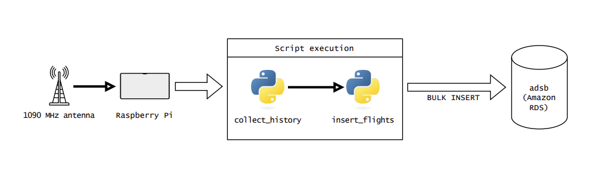
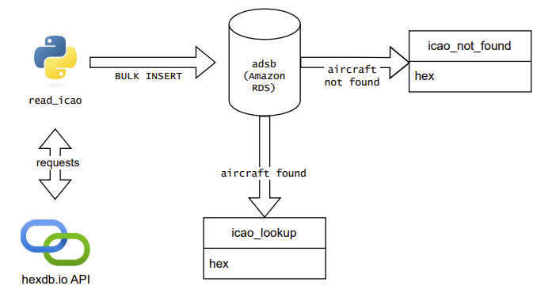

# ads-b
Pipe data from Flightaware dump1090 JSON files into a Postgres SQL database
## Overview
This repository demonstrates a means to pipe aviation data from a Raspberry Pi running dump1090 into a Postgres database. The basic mechanism utilizes the set of JSON files in ````/run/dump1090-fa````, each of which update on a rolling one hour basis. Consequently, this process is quasi-realtime in that ````dump1090```` writes to a JSON file every 30 seconds.

## Database schema
- ````flights```` - contains the raw records coming from ````dump1090````
- ````icao_lookup```` - maps aircraft ICAO hex code to aircraft type and ownership
- ````icao_not_found```` - list of hex codes that we don't have aircraft information for

The database can be constructed by executing the SQL DDL found in the ````sql```` folder of this repository. 

## Process
The Python scripts ````collect_history.py```` and ````insert_flights.py```` run in succession on an hourly basis. Their calls are wrapped inside a bash script which in turn is scheduled in a Linux cron job.

````collect_history```` collapses all of the JSON files in ````/run/dump1090-fa```` into a single JSON file, which ````insert_flights```` then bulk inserts into ````adsb````.

[](docs/overall_pipeline.pdf)

## Aircraft type lookup by ICAO hex code
The Python script ````read_icao.py```` can be run on an *ad hoc* basis to pull aircraft information (type and owner) into the ````icao_lookup```` table. This utilizes the hexdb.io API, and in particular this endpoint: https://hexdb.io/api/aircraft/hex_code.

The script examines all records in the ````flights```` that were inserted since the previous run of the script (determined by the maximum ````load_date```` in ````icao_lookup````). Hex codes that cause the API to return a 404 get inserted in ````icao_not_found````.

[](docs/read_icao_flow.pdf)

## Architecture notes
This pipeline was first entirely developed in Windows. It is now being thoroughly tested with Python execution on the Raspberry Pi, and the database has been ported to Amazon RDS. 

> Written with [StackEdit](https://stackedit.io/).
